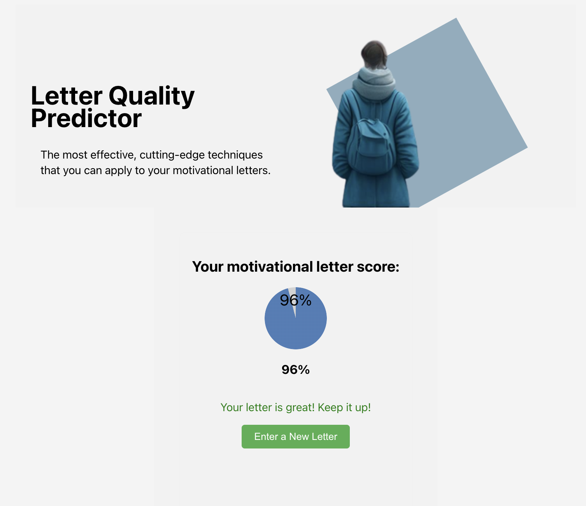

# Recomendation system for motivation letters

## My study project for creating program tool using machine learning 

## Installation
- Download or clone repository
- Install npm dependencies using `npm i`
- Start server side using `python app.py` command
- Launch service in **development** mode using `npm run dev` or launch a **production build** using `npm run start`

